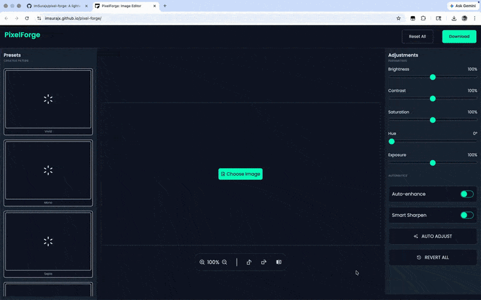

# 🎨 PixelForge

<p align="center">
  
  
  
  
</p>

<p align="center">
  <b>A browser-based image editor built with HTML Canvas & Vanilla JavaScript</b><br>
  Real-time editing, transformations, presets, and downloadable exports.
</p>

# 📸 Project Preview

<p align="center">
  
</p>

# 🎯 About The Project

PixelForge is a fully functional browser-based image editor built using **HTML5 Canvas** and **Vanilla JavaScript**.

This project was created with a **logic-first development approach** to deeply understand how image editing software works internally by manipulating pixels directly, managing rendering pipelines, and building UI interactions without external libraries.

It focuses on mastering core frontend engineering concepts rather than relying on frameworks.

# 🚀 Core Features

<p align="left">
  
  
  
  
  
  
  
  
  
  
  
  
  
</p>

# 🧠 What I Learned

This project helped strengthen my understanding of:

- HTML Canvas rendering lifecycle
- Pixel-level image manipulation
- RGB ↔ HSL color conversion logic
- Real-time filter pipelines
- State management vs UI synchronization
- DOM event handling architecture
- Exporting transformed canvas images
- Debugging complex frontend interactions
- Building complete projects from scratch

# ⚙️ Tech Stack

<p align="left">
  
  
  
  
</p>

# 🛠️ Run Locally

```bash
git clone https://github.com/your-username/pixelforge.git
cd pixelforge
open index.html
```

# 🏗️ Development Journey

PixelForge was built feature-by-feature through iterative development:

- Canvas image rendering
- Real-time brightness & contrast engine
- Saturation & exposure controls
- Hue rotation using HSL conversion
- Rotate / flip transformations
- Preset thumbnails generation
- Utility actions & resets
- Final downloadable exports

# ⚠️ Current Limitations

- Large images may reduce performance
- No crop tool yet
- No undo / redo history
- CPU-based processing (no GPU acceleration)

# 🔮 Future Improvements

<p>
  
  
  
  
  
</p>

# 👨‍💻 Author

<p>
  
</p>
<p align="center">
  ⭐ If you like this project, consider starring the repository.
</p>
